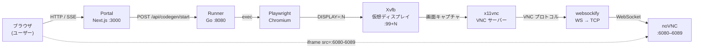

# noVNC アーキテクチャ

`USE_NOVNC=true` のとき、codegen セッションはポータル内の iframe でライブプレビューされる。

---

## 全体フロー



---

## 各コンポーネントの役割

| コンポーネント | 役割 |
|---------------|------|
| **Xvfb** | 仮想フレームバッファ。物理ディスプレイなしで Chromium を描画する |
| **x11vnc** | Xvfb の画面を VNC プロトコルで配信する |
| **websockify** | VNC の TCP 接続を WebSocket にプロキシする。noVNC が必要とする |
| **noVNC** | WebSocket 越しに VNC を表示する Web クライアント。ブラウザ上で動く |

---

## ポート割り当て

Runner は `6080–6089` の 10 ポートをプールで管理する。
`codegen/start` が呼ばれるたびに空きポートを 1 つ確保し、`noVNCPort` としてレスポンスに返す。

```
セッション 1 → :6080
セッション 2 → :6081
...
セッション 10 → :6089
セッション 11 → 満杯エラー（上限 10 並行）
```

Portal はこのポートを使って `http://<NEXT_PUBLIC_NOVNC_HOST>:<noVNCPort>/vnc.html` の iframe を組み立てる。

---

## 環境変数

| 変数 | 設定箇所 | 説明 |
|------|---------|------|
| `USE_NOVNC` | Runner | `true` にすると Xvfb + x11vnc + noVNC を起動 |
| `NEXT_PUBLIC_NOVNC_HOST` | Portal | iframe URL のホスト名（例: `http://localhost`） |

> `docker-compose.yml` では両方自動設定済み。手動起動時は Runner と Portal の両方に設定が必要。

---

## USE_NOVNC=false のとき

ブラウザプレビューなし。Runner は codegen を起動するが、結果の `.spec.ts` ファイルは
SSE (`/api/codegen/stream`) でステータスが流れるだけ。

ローカル開発や CI 環境など、仮想ディスプレイを用意できない場合はこちらを使う。

---

## デモ

> [!NOTE]
> **GIF 差し替え待ち** — `docs/assets/demo-novnc.gif` と置き換えてください
> キャプチャ内容: URL 入力 → 記録開始 → iframe に Chromium が映る → 操作 → 保存
>
> 推奨キャプチャツール（macOS）: [Kap](https://getkap.co/)
