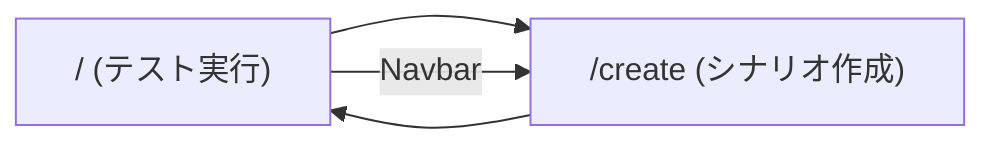

# Portal UI 開発

## Storybook

ポータルの UI コンポーネントを Storybook で単体確認できる。

### バージョン

| パッケージ | バージョン |
|-----------|-----------|
| `storybook` | ^10 |
| `@storybook/nextjs` | ^10 |
| フレームワーク | Next.js 15 (App Router) + TypeScript |

### 起動

```bash
cd portal
npm run storybook
# → http://localhost:6006
```

### 静的ビルド

```bash
npm run build-storybook
# → portal/storybook-static/
```

### 現在の Stories

| ファイル | 対象ページ |
|---------|-----------|
| `app/page.stories.tsx` | テスト実行ページ (`/`) |
| `app/create/page.stories.tsx` | シナリオ作成ページ (`/create`) |

---

## ページ構成



### テスト実行ページ (`/`)

- タグ一覧を Runner から取得し、タグ指定で実行できる
- シナリオ（`.spec.ts` ファイル）を個別に選択して実行できる
- 実行ログは SSE でリアルタイム表示
- 実行完了後、Playwright HTML レポートへのリンクが表示される

> [!NOTE]
> **GIF 差し替え待ち** — `docs/assets/demo-run.gif` と置き換えてください
> キャプチャ内容: シナリオ選択 → 実行 → ログが流れる → レポートが開く

### シナリオ作成ページ (`/create`)

- URL を入力し「記録開始」でブラウザを起動
- `USE_NOVNC=true` のとき iframe にライブプレビューが表示される
- ブラウザを閉じると `.spec.ts` が保存される

詳細は [noVNC アーキテクチャ](./novnc-architecture.md) を参照。

> [!NOTE]
> **GIF 差し替え待ち** — `docs/assets/demo-record.gif` と置き換えてください
> キャプチャ内容: URL 入力 → 記録開始 → noVNC が表示 → 操作 → ファイル保存

---

## UI テスト仕様

Playwright BDD テストの仕様: [`spec/portal-ui.md`](../spec/portal-ui.md)
