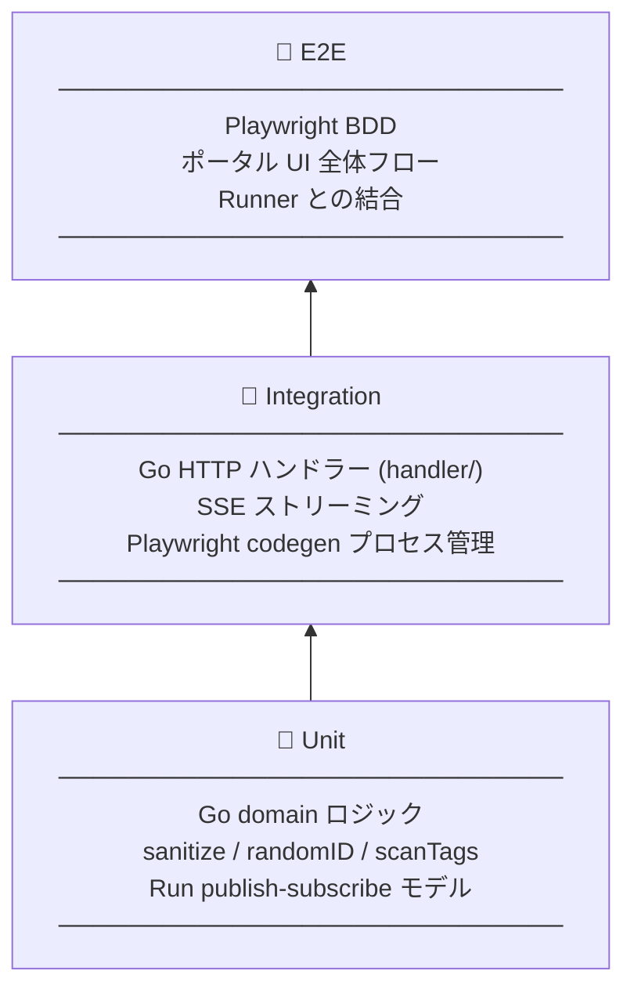

# テスト戦略

## 2種類の「テスト」

このリポジトリでは「テスト」という言葉が2つの意味で使われる。

| 種類 | 内容 | 場所 |
|------|------|------|
| **ツール自身のテスト** | e2e-tr の品質を保証するテスト | `runner/` 配下・`tests/portal-tests/` |
| **ツールで録るテスト** | ユーザーが codegen で記録した対象アプリのテスト | `tests/tests/*.spec.ts` |

---

## ツール自身のテストピラミッド



### Unit（Go domain）

`runner/` の純粋なロジック層。外部依存なし、高速に数十テストが走る。

- `sanitize.go` — パストラバーサル除去
- `scan.go` — `.spec.ts` タグスキャン
- `run.go` — pub/sub モデル（goroutine 競合テスト含む）

### Integration（Go handler/executor）

HTTP エンドポイントと SSE ストリームを実際に立ち上げてテストする。
Playwright サブプロセスの起動・停止もここでカバー。

仕様: [`spec/runner.md`](../spec/runner.md)

### E2E（Playwright BDD）

`tests/portal-tests/` にある Playwright テスト。
実際に portal (:3000) + runner (:8080) を起動し、ブラウザ操作で検証する。

仕様: [`spec/portal-ui.md`](../spec/portal-ui.md)

---

## ツールで録るテスト（出力物）

ポータルの「シナリオ作成」で記録した `.spec.ts` ファイルは `tests/tests/` に保存される。
これらはこのリポジトリのテストではなく、**ユーザーのアプリを検証する E2E テスト**。

```
tests/tests/
  ├── scenario-xxx.spec.ts   ← codegen で記録
  ├── codegen-i18n.spec.ts   ← 手動作成の例
  └── test.spec.ts
```

タグ（`@smoke`, `@cart` など）でグループ化し、ポータルの「テスト実行」ページからタグや個別ファイルを選んで実行できる。

---

## カバレッジ状況

実装済み・未実装の一覧は各 spec ファイルを参照。

- Go: [`spec/runner.md`](../spec/runner.md)
- Portal UI: [`spec/portal-ui.md`](../spec/portal-ui.md)

未実装（📝）のケースが多い領域は Executor のタイムアウト/エラーハンドリングとハンドラーの実行フロー。
