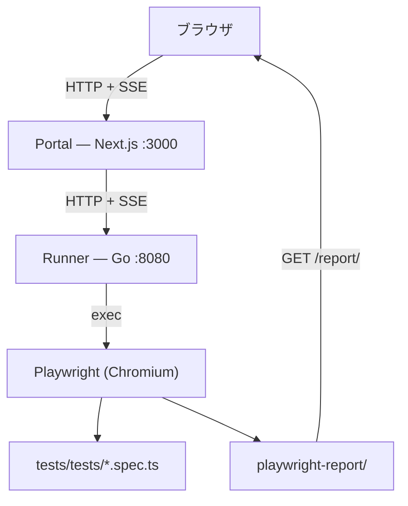

[](readme.md)

# e2e-tr

QA エンジニアや非エンジニアが **ブラウザだけで Playwright E2E テストを記録・実行できる**セルフホスト型 Web ポータル。CLI 不要。

> **ステータス:** デモ / モック版。AWS インフラ（Terraform）は将来リリース予定。

---

## デモ

### テストを記録する

> [!NOTE]
> **GIF 差し替え待ち** — `docs/assets/demo-record.gif` と置き換えてください
> キャプチャ内容: URL 入力 → 記録開始 → noVNC に Chromium が映る → 操作 → `.spec.ts` 保存

### テストを実行する

> [!NOTE]
> **GIF 差し替え待ち** — `docs/assets/demo-run.gif` と置き換えてください
> キャプチャ内容: シナリオ選択 → 実行 → SSE ログが流れる → HTML レポートへ遷移

---

## できること

### シナリオを記録する
1. ポータルを開いて URL を入力する
2. Playwright の codegen で Chromium が起動する
3. アプリをクリックして操作 — アクションが自動で記録される
4. `USE_NOVNC=true` のとき、ライブブラウザセッションがポータルに noVNC iframe として埋め込まれる
5. ブラウザを閉じる → テストが `.spec.ts` として保存される

### テストを実行する
- **タグで実行** — `@search`, `@cart` などのタグが付いたテストをまとめて実行
- **シナリオで実行** — 保存済みの `.spec.ts` ファイルを個別に選んで実行
- SSE でログをリアルタイム表示
- 完了後、Playwright HTML レポート（スクリーンショット・動画・トレース）へ直接ジャンプ

---

## アーキテクチャ



**noVNC が必要な理由:** Docker 内で Chromium を起動すると物理ディスプレイがないため、コンテナ外からブラウザを見ることも操作することもできない。noVNC は仮想ディスプレイ（Xvfb）の映像を WebSocket で配信し、ポータルの iframe に埋め込むことでこの問題を解決する。**Docker Compose + `USE_NOVNC=true` がこのツールの主要なユースケース。** → [noVNC アーキテクチャ詳細](docs/novnc-architecture.md)

---

## 技術スタック

| レイヤー | 技術 |
|---------|------|
| Portal UI | Next.js 16 (App Router) + TypeScript |
| API サーバー | Go (net/http, SSE ストリーミング) |
| テスト実行 | Playwright + TypeScript |
| リアルタイムログ | Server-Sent Events (SSE) |
| ブラウザプレビュー | noVNC (Xvfb + x11vnc + websockify) |
| コンテナ | Docker / docker-compose |
| インフラ | Terraform（予定） |

---

## はじめ方

### Option A — Docker Compose（推奨）

必要なのは Docker だけ。

```bash
make up
# Portal  → http://localhost:3000
# Runner  → http://localhost:8080
# noVNC   → http://localhost:6080–6089 (codegen セッションごとに 1 ポート)
```

`docker-compose.yml` が `USE_NOVNC=true` と `NEXT_PUBLIC_NOVNC_HOST` を自動設定する。

### Option B — 手動セットアップ

前提条件: Go 1.25+、Node.js 20+。

**1. テストのセットアップ**

```bash
cd tests
npm install
npx playwright install chromium
```

**2. Runner を起動**

```bash
cd runner
go run .
# → http://localhost:8080
```

**3. Portal を起動**

```bash
cd portal
npm install
NEXT_PUBLIC_API_URL=http://localhost:8080 npm run dev
# → http://localhost:3000
```

ブラウザで `http://localhost:3000` を開く。

---

## 環境変数

| 変数 | サービス | デフォルト | 説明 |
|------|---------|-----------|------|
| `TESTS_DIR` | runner | `../tests` | テストディレクトリのパス |
| `PORT` | runner | `127.0.0.1:8080` | HTTP リッスンアドレス。既定は localhost 限定。公開する場合は `0.0.0.0:8080` 等に広げる（認証必須・Known limitations 参照） |
| `ALLOWED_ORIGINS` | runner | （localhost のみ） | `SameOriginGuard` が追加で許可するオリジン（カンマ区切り）。`localhost`/`127.0.0.1`（任意ポート）は常に許可 |
| `DB_PATH` | runner | `./runner.db` | SQLite パス（予約済み・未使用） |
| `USE_NOVNC` | runner | `false` | Xvfb + x11vnc + noVNC を有効化（最大 10 並行セッション） |
| `NEXT_PUBLIC_API_URL` | portal | `http://localhost:8080` | Runner API のベース URL |
| `NEXT_PUBLIC_NOVNC_HOST` | portal | `http://localhost` | noVNC iframe URL のホスト名 |

---

## API

| メソッド | パス | 説明 |
|---------|------|------|
| `GET` | `/api/tags` | `.spec.ts` からスキャンしたタグ一覧を返す |
| `POST` | `/api/run` | タグまたはファイル指定でテストを実行 |
| `GET` | `/api/stream?id=` | 実行ログの SSE ストリーム |
| `POST` | `/api/codegen/start` | Playwright codegen セッション開始。`USE_NOVNC=true` のとき `noVNCPort` を返す |
| `GET` | `/api/codegen/stream?id=` | codegen ステータスの SSE ストリーム |
| `GET` | `/api/scenarios` | シナリオファイル一覧を返す |
| `DELETE` | `/api/scenarios?name=` | シナリオファイルを削除 |
| `GET` | `/report/` | Playwright HTML レポート |

---

## テスト

このリポジトリ自身のテスト戦略（テストピラミッド）→ [テスト戦略](docs/testing-strategy.md)

### テストの実行

```bash
just ci                   # CI 相当をローカル実行（runner build/vet/test + portal build + compose E2E）
make test-runner          # Go ユニットテストのみ
make test-portal          # ポータル E2E テスト（要: make up）
make test-e2e             # ユーザーシナリオテストのみ（要: make up）
make test                 # 全テスト実行（runner + portal E2E、スタックの起動/停止を自動化）
```

BDD 仕様書: [`spec/runner.md`](spec/runner.md) | [`spec/portal-ui.md`](spec/portal-ui.md)

---

## 既知の制限事項

- **実行履歴はメモリのみ。** 完了した実行はメモリに保存されるため、再起動すると消える。永続ストレージは予定。
- **認証なし。** runner はログインを持たず任意の spec を実行できるため、公開された instance は実質的にリモートコード実行（RCE）の口になりうる。安全側の既定として runner は `127.0.0.1`（localhost 限定）にバインドし、`SameOriginGuard` がブラウザ経由のクロスオリジンリクエストを拒否する。**公開する場合は** `PORT`（例 `0.0.0.0:8080`）でバインドを広げ、`ALLOWED_ORIGINS` でフロントエンドのオリジンを許可したうえで、**必ず前段に認証を置くこと**（リバースプロキシや Web 版の認証ミドルウェア等）。そのまま公開しないこと。
- **シングルランナー。** テストは 1 台で順次実行される。ECS タスクによる並列実行は将来予定。

---

## ロードマップ

- [ ] Terraform による AWS インフラ（App Runner + ECS Fargate + S3）
- [ ] 実行履歴の永続化
- [ ] タグによる並列テスト実行
- [ ] 認証

---

## ライセンス

MIT
