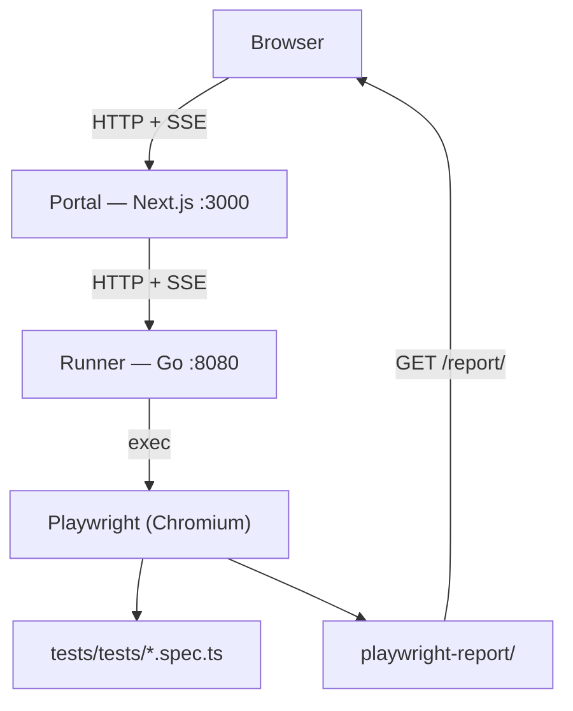

[](readme.ja.md)

# e2e-tr

A self-hosted web portal that lets QA engineers and non-technical team members **record and run Playwright E2E tests from a browser** — no CLI required.

> **Status:** Demo / mock version. AWS infrastructure (Terraform) is planned for a future release.

---

## Demo

### Record a scenario

> [!NOTE]
> **GIF coming soon** — replace with `docs/assets/demo-record.gif`
> Capture: enter URL → click "Start recording" → Chromium appears in noVNC iframe → interact → `.spec.ts` saved

### Run tests

> [!NOTE]
> **GIF coming soon** — replace with `docs/assets/demo-run.gif`
> Capture: select scenario → run → SSE log streams → jump to HTML report

---

## What you can do

### Record a scenario
1. Open the portal and enter a URL
2. Chromium launches with Playwright's codegen
3. Click through your app — actions are recorded automatically
4. When `USE_NOVNC=true`, the live browser session is embedded in the portal via a noVNC iframe
5. Close the browser → the test is saved as a `.spec.ts` file

### Run tests
- **By tag** — run all tests tagged `@search`, `@cart`, etc.
- **By scenario** — pick any recorded `.spec.ts` file from the list
- Live log output streams in real-time via SSE
- When done, jump directly to the Playwright HTML report (screenshots, video, trace)

---

## Architecture



**Why noVNC?** When running inside Docker, Chromium has no physical display — you can't see or interact with the codegen browser from your machine. noVNC solves this by streaming the virtual display (`Xvfb`) over WebSocket, embedding it as an iframe in the portal. This is the primary use case: **Docker Compose with `USE_NOVNC=true` is the fully supported path.** → [noVNC architecture](docs/novnc-architecture.md)

---

## Tech stack

| Layer | Technology |
|-------|------------|
| Portal UI | Next.js 16 (App Router) + TypeScript |
| UI component development | Storybook 10 |
| API server | Go (net/http, SSE streaming) |
| Test execution | Playwright + TypeScript |
| Realtime logs | Server-Sent Events (SSE) |
| Browser preview | noVNC (Xvfb + x11vnc + websockify) |
| Container | Docker / docker-compose |
| Infrastructure | Terraform (planned) |

---

## Getting started

### Prerequisites

- Go 1.21+
- Node.js 20+
- Playwright installed in `tests/`

### Option A — Docker Compose (recommended)

```bash
make up
# Portal  → http://localhost:3000
# Runner  → http://localhost:8080
# noVNC   → http://localhost:6080–6089 (one port per codegen session)
```

`docker-compose.yml` sets `USE_NOVNC=true` and `NEXT_PUBLIC_NOVNC_HOST` automatically.

### Option B — Manual setup

**1. Set up tests**

```bash
cd tests
npm install
npx playwright install chromium
```

**2. Start the runner**

```bash
cd runner
go run .
# → http://localhost:8080
```

**3. Start the portal**

```bash
cd portal
npm install
NEXT_PUBLIC_API_URL=http://localhost:8080 npm run dev
# → http://localhost:3000
```

Open `http://localhost:3000` in your browser.

---

## Storybook

Develop and preview portal UI components in isolation.

```bash
cd portal
npm run storybook
# → http://localhost:6006
```

→ [Portal UI development guide](docs/portal-ui.md)

---

## Environment variables

| Variable | Service | Default | Description |
|----------|---------|---------|-------------|
| `TESTS_DIR` | runner | `../tests` | Path to the tests directory |
| `PORT` | runner | `:8080` | HTTP listen address |
| `DB_PATH` | runner | `./runner.db` | SQLite path (reserved, not yet used) |
| `USE_NOVNC` | runner | `false` | Enable Xvfb + x11vnc + noVNC for codegen browser preview (up to 10 concurrent sessions) |
| `RUN_TIMEOUT_MINUTES` | runner | `30` | Maximum minutes a single test run is allowed to execute before it is forcibly killed |
| `MAX_CONCURRENT_RUNS` | runner | `1` | Maximum number of test runs that may execute in parallel; excess requests receive HTTP 429 |
| `NEXT_PUBLIC_API_URL` | portal | `http://localhost:8080` | Runner API base URL |
| `NEXT_PUBLIC_NOVNC_HOST` | portal | `http://localhost` | Hostname used to build noVNC iframe URLs |

---

## API

| Method | Path | Description |
|--------|------|-------------|
| `GET` | `/api/tags` | List test tags scanned from `.spec.ts` files |
| `POST` | `/api/run` | Run tests by tag or file |
| `GET` | `/api/stream?id=` | SSE stream of run logs |
| `POST` | `/api/codegen/start` | Start a Playwright codegen session; returns `noVNCPort` when `USE_NOVNC=true` |
| `GET` | `/api/codegen/stream?id=` | SSE stream of codegen status |
| `GET` | `/api/scenarios` | List saved scenario files |
| `DELETE` | `/api/scenarios?name=` | Delete a scenario file |
| `GET` | `/report/` | Playwright HTML report |

---

## Testing

Test strategy and pyramid for this repository → [Testing strategy](docs/testing-strategy.md)

### Run tests

```bash
make test-runner          # Go unit tests only
make test-portal          # Portal E2E tests (requires: make up)
make test-e2e             # User scenario tests (requires: make up)
make test                 # Run all (runner unit + portal E2E, starts/stops the stack automatically)
```

BDD specifications: [`spec/runner.md`](spec/runner.md) | [`spec/portal-ui.md`](spec/portal-ui.md)

---

## Known limitations

- **In-memory run history.** Completed runs are stored in memory only and lost on restart. Persistent storage is planned.
- **No authentication.** The portal has no login. Do not expose it to the public internet as-is.
- **Configurable concurrency, single machine.** `MAX_CONCURRENT_RUNS` (default `1`) controls how many tests run in parallel, but all runs share one machine. Parallel execution across ECS tasks is a planned feature.

---

## Roadmap

- [ ] AWS infrastructure via Terraform (App Runner + ECS Fargate + S3)
- [ ] Persistent run history
- [ ] Parallel test execution by tag
- [ ] Authentication

---

## License

MIT
